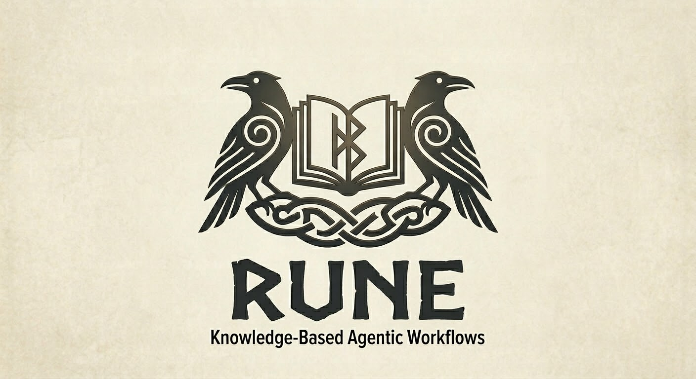
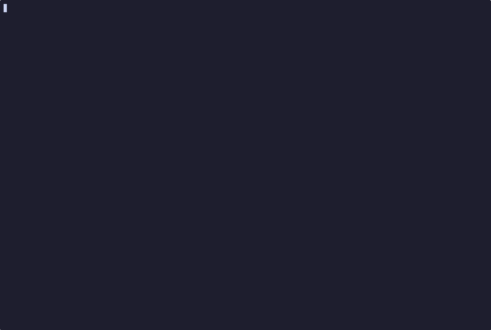

<div align="center"></div>

# Rune

**Rune** (`rune`) - A command-line toolkit that turns AI coding assistants into an orchestrated team of experts.

# DESCRIPTION

AI coding agents are powerful but chaotic. Left to their own devices, they duplicate work, lose context, overwrite each other's files, and run destructive commands.

**Rune** aims to help with this. It is a CLI that manages the "knowledge layer" and "orchestration layer" for tools like [Claude Code](https://claude.ai/code). It doesn't wrap the AI; it configures the AI's environment so that when you ask it to work, it operates as a disciplined team: exploring the problem, planning the work, building in parallel, and validating before shipping.

For the guided walkthrough, concepts, manual pages, and deep dives, start with the **[documentation site](https://kvasir-ai.github.io/rune/#quick-start)**.

<p align="center">
  
  <br />
  <em>Built-in Rune demo: the Four-Phase Model in one guided flow.</em>
</p>

# QUICK START

**OS Requirements:** macOS or Linux/WSL2.

First, install [uv](https://docs.astral.sh/uv/) if you don't already have it:

**macOS:** `brew install uv`
**Linux / WSL2:** `curl -LsSf https://astral.sh/uv/install.sh | sh`

Install Rune and set it up:

```bash
git clone https://github.com/kvasir-ai/rune.git && cd rune
uv tool install .
rune setup
rune profile use explore
rune system verify
```

If you want Rune scoped to one repository instead of your home AI tool directory, run `rune profile use explore --project` from that repository after setup.

After setup, the most useful commands are:

| Command | What it does |
|---|---|
| `rune demo` | See the workflow in action |
| `rune profile use <name>` | Apply a profile |
| `rune system verify` | Confirm deployed state matches configuration |
| `rune profile list` | Browse available profiles |
| `rune resource list` | Browse deployed agents, rules, and skills |

## Rune Inside Claude

The built-in `rune demo` explains the model. This is what the workflow looks like when invoked from a real Claude CLI session with `/rune-demo`.

<p align="center">
  
  <br />
  <em>Real Claude execution: <code>/rune-demo</code> running inside the assistant.</em>
</p>

Open your coding tool in a project, then start with a simple request like `explore this repo`.

---

[](LICENSE)
[](https://kvasir-ai.github.io/rune/)
