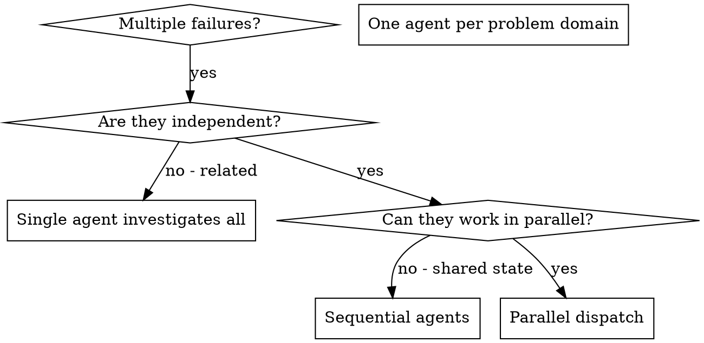

# Dispatching Parallel Agents

## Overview

When you have multiple independent tasks — debugging failures, exploring subsystems, or implementing isolated features — doing them sequentially wastes time. Each task is independent and can happen in parallel.

> **When to use this vs /subagent-driven-development:** Use this skill for ad-hoc tasks (debugging, exploration, independent fixes). For executing formal implementation plans with quality review gates, prefer `/subagent-driven-development` instead.

**Core principle:** Dispatch one agent per independent problem domain. Let them work concurrently.

## When to Use



**Use when:**
- 2+ test files failing with different root causes
- Multiple subsystems broken independently
- Parallel exploration of unrelated parts of a codebase
- Independent implementation tasks that touch different files
- Each task can be understood without context from others
- No shared state between agents

**Don't use when:**
- Failures are related (fix one might fix others)
- Need to understand full system state first
- Agents would interfere with each other (editing same files)
- Tasks have sequential dependencies

## The Pattern

### 1. Identify Independent Domains

Group failures by what's broken:
- File A tests: Tool approval flow
- File B tests: Batch completion behavior
- File C tests: Abort functionality

Each domain is independent - fixing tool approval doesn't affect abort tests.

### 2. Create Focused Agent Tasks

Each agent gets:
- **Specific scope:** One test file or subsystem
- **Clear goal:** Make these tests pass
- **Constraints:** Don't change other code
- **Expected output:** Summary of what you found and fixed

### 3. Dispatch in Parallel

```typescript
// In Claude Code / AI environment
Task("Fix agent-tool-abort.test.ts failures")
Task("Fix batch-completion-behavior.test.ts failures")
Task("Fix tool-approval-race-conditions.test.ts failures")
// All three run concurrently
```

### 4. Review and Integrate

When agents return:
- Read each summary
- Verify fixes don't conflict
- Run full test suite
- Integrate all changes

## Prompt Template

Use `./parallel-agent-prompt.md` when dispatching each agent.

Good agent prompts are:
1. **Focused** - One clear problem domain
2. **Self-contained** - All context needed to understand the problem
3. **Specific about output** - What should the agent return?

## Common Mistakes

**❌ Too broad:** "Fix all the tests" - agent gets lost
**✅ Specific:** "Fix agent-tool-abort.test.ts" - focused scope

**❌ No context:** "Fix the race condition" - agent doesn't know where
**✅ Context:** Paste the error messages and test names

**❌ No constraints:** Agent might refactor everything
**✅ Constraints:** "Do NOT change production code" or "Fix tests only"

**❌ Vague output:** "Fix it" - you don't know what changed
**✅ Specific:** "Return summary of root cause and changes"

## When NOT to Use

**Related failures:** Fixing one might fix others - investigate together first
**Need full context:** Understanding requires seeing entire system
**Exploratory debugging:** You don't know what's broken yet
**Shared state:** Agents would interfere (editing same files, using same resources)

## Real Example from Session

**Scenario:** 6 test failures across 3 files after major refactoring

**Failures:**
- agent-tool-abort.test.ts: 3 failures (timing issues)
- batch-completion-behavior.test.ts: 2 failures (tools not executing)
- tool-approval-race-conditions.test.ts: 1 failure (execution count = 0)

**Decision:** Independent domains - abort logic separate from batch completion separate from race conditions

**Dispatch:**
```
Agent 1 → Fix agent-tool-abort.test.ts
Agent 2 → Fix batch-completion-behavior.test.ts
Agent 3 → Fix tool-approval-race-conditions.test.ts
```

**Results:**
- Agent 1: Replaced timeouts with event-based waiting
- Agent 2: Fixed event structure bug (threadId in wrong place)
- Agent 3: Added wait for async tool execution to complete

**Integration:** All fixes independent, no conflicts, full suite green

**Time saved:** 3 problems solved in parallel vs sequentially

## Key Benefits

1. **Parallelization** - Multiple investigations happen simultaneously
2. **Focus** - Each agent has narrow scope, less context to track
3. **Independence** - Agents don't interfere with each other
4. **Speed** - 3 problems solved in time of 1

## Verification

After agents return:
1. **Review each summary** - Understand what changed
2. **Check for conflicts** - Did agents edit same code?
3. **Run full suite** - Verify all fixes work together
4. **Spot check** - Agents can make systematic errors

## Conflict Resolution

If agents edited the same files:

1. **Read both agents' summaries** — understand what each changed and why
2. **Compare changes** — use `git diff` to see overlapping edits
3. **Merge manually** — combine changes, keeping the intent of both agents
4. **Re-run tests** — verify the merged result works

Prevention is better than resolution: when scoping agents, explicitly list which files each agent owns. If two problems require touching the same file, they're not independent — handle them sequentially.

## Real-World Impact

From production experience:
- 6 failures across 3 files
- 3 agents dispatched in parallel
- All investigations completed concurrently
- All fixes integrated successfully
- Zero conflicts between agent changes

## Integration

**Works with:**
- **verification-before-completion** — After integrating all agent results, verify before claiming done
- **finishing-development-branch** — When parallel work completes a feature, use this to wrap up

**Used by:**
- **subagent-driven-development** — For cases where tasks are independent enough to parallelize investigation (not implementation)
